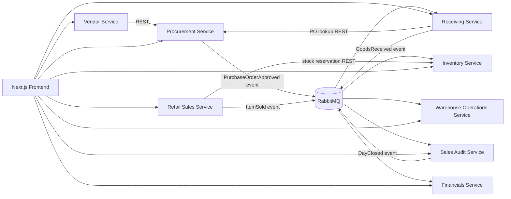

# Merchandising Funnel Automation

A distributed merchandise management system for the flow of goods and money from supplier purchase through warehouse receiving and retail sale to financial reporting. Each service owns its own PostgreSQL database and communicates with other services through HTTP APIs or durable RabbitMQ events.

## Architecture

## Modules

| Module | Service path | Phase | Responsibility | Feature flag |
|---|---|---:|---|---|
| Vendor Management | `apps/vendor-service` | 1 | Supplier profiles and catalog | `vendor-management` |
| Procurement | `apps/procurement-service` | 1 | Purchase orders and approval | `procurement` |
| Inventory | `apps/inventory-service` | 1 | On-hand stock, reservations, and valuation | `inventory` |
| Receiving | `apps/receiving-service` | 2 | Validate PO deliveries and create GRNs | `receiving` |
| Warehouse Operations | `apps/warehouse-operations-service` | 2 | Storage locations, putaway/pick/transfer tasks | `warehouse-operations` |
| Retail Sales | `apps/retail-sales-service` | 3 | Checkout, tenders, and item sold events | `retail-sales` |
| Sales Audit | `apps/sales-audit-service` | 3 | Register tender reconciliation and close | `sales-audit` |
| Financials | `apps/financials-service` | 4 | Event-driven journal, AP, and reports | `financials` |

The frontend is in `apps/frontend`. New service OpenAPI descriptions are in `contracts/openapi/`.

## Local development

Use Node.js with npm workspaces, PostgreSQL, and RabbitMQ. Copy `.env.example` to `.env`, create one database for each service, then apply the SQL schema in each service's `schema.sql` (the Receiving schema is managed with Drizzle migrations). Start PostgreSQL and RabbitMQ before starting the services.

Start each service in a separate terminal with `npm run dev --workspace=@mms/<service-name>`. Start the frontend with `npm run dev --workspace=frontend`. Backend ports default to 3001–3008. The frontend calls services through the rewrites in `apps/frontend/next.config.ts`.

## Feature flags

Set the flags in `config/features.json` to `true` or `false`. The backend mounts each phase's routes only when that module's flag is enabled. Health endpoints remain available while a feature is disabled.

## APIs and events

OpenAPI contracts: `contracts/openapi/vendor-service.yaml`, `procurement-service.yaml`, `receiving-service.yaml`, `warehouse-operations-service.yaml`, `retail-sales-service.yaml`, `sales-audit-service.yaml`, and `financials-service.yaml`.

The event exchange is the durable RabbitMQ topic exchange `mms.events`. Domain events include `PurchaseOrderApproved`, `GoodsReceived`, `ItemSold`, and `DayClosed`. Consumers use event IDs for deduplication where their service schema provides an event ledger.

## Tests and builds

Run `npm run build` for all workspace builds, `npm run test:phases-2-4` for the new module unit suites, and `npm test` for all service suites. The event outbox integration test requires `OUTBOX_TEST_DATABASE_URL` and `OUTBOX_TEST_RABBITMQ_URL`; it verifies PostgreSQL outbox persistence through confirmed RabbitMQ delivery. CI provisions those dependencies and runs builds and tests. Each service owns a separate PostgreSQL database.
