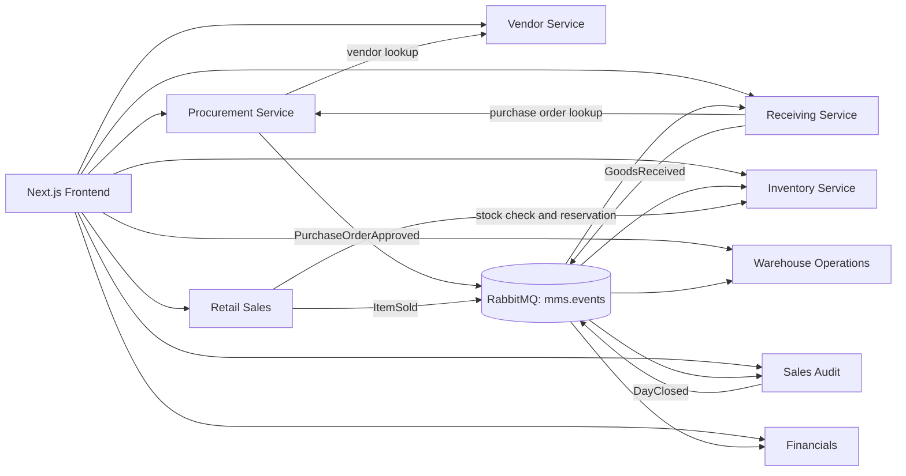

# Merchandising Funnel Automation

A modular merchandise management system that follows the flow of goods and money from supplier setup and purchasing through receiving, warehousing, retail sales, audit, and financial reporting. The project is an npm-workspace monorepo with a Next.js frontend, eight independently deployable backend services, and shared TypeScript packages.

Each backend service owns its PostgreSQL database. Services communicate through HTTP APIs for synchronous lookups and commands, and through durable RabbitMQ events for cross-service updates. The frontend calls the backend APIs through local Next.js rewrites.

## Business flow and architecture



### Modules

| Module | Workspace | Responsibility | Default port | Feature flag |
|---|---|---|---:|---|
| Vendor Management | [`apps/vendor-service`](apps/vendor-service/README.md) | Supplier profiles, product catalog, and reliability data | 3001 | `vendor-management` |
| Procurement | [`apps/procurement-service`](apps/procurement-service/README.md) | Purchase orders, item pricing snapshots, and approvals | 3002 | `procurement` |
| Inventory | [`apps/inventory-service`](apps/inventory-service/README.md) | Stock, locations, reservations, movements, and valuation | 3003 | `inventory` |
| Receiving | [`apps/receiving-service`](apps/receiving-service/README.md) | Goods receipts and delivery discrepancies | 3004 | `receiving` |
| Warehouse Operations | [`apps/warehouse-operations-service`](apps/warehouse-operations-service/README.md) | Storage locations, putaway, pick, and transfer tasks | 3005 | `warehouse-operations` |
| Retail Sales | [`apps/retail-sales-service`](apps/retail-sales-service/README.md) | Point-of-sale transactions, payments, and stock reservations | 3006 | `retail-sales` |
| Sales Audit | [`apps/sales-audit-service`](apps/sales-audit-service/README.md) | Tender reconciliation and register closeout | 3007 | `sales-audit` |
| Financials | [`apps/financials-service`](apps/financials-service/README.md) | Event-driven journal entries, payables, and reports | 3008 | `financials` |
| Frontend | [`apps/frontend`](apps/frontend/README.md) | Web interface for the service modules | 3000 | — |
| Event Outbox | [`packages/event-outbox`](packages/event-outbox/README.md) | Reliable PostgreSQL outbox publishing to RabbitMQ | — | — |
| Feature Flags | [`packages/feature-flags`](packages/feature-flags/README.md) | Shared module enablement configuration | — | — |

## Technology

- Node.js and npm workspaces
- TypeScript and Express for backend services
- Next.js, React, and Tailwind CSS for the frontend
- PostgreSQL for service-owned persistence
- Drizzle ORM and Drizzle Kit in services that use generated migrations
- RabbitMQ for asynchronous domain events
- Vitest for service and package tests

## Prerequisites

Install a Node.js version compatible with the workspace dependencies, npm, and Docker with Docker Compose. Local development uses the PostgreSQL and RabbitMQ services defined in [`infrastructure/docker/docker-compose.yml`](infrastructure/docker/docker-compose.yml).

## Local setup

From the repository root:

```bash
npm install
docker compose -f infrastructure/docker/docker-compose.yml up -d
cp .env.example .env
```

The provided `.env.example` contains local connection strings and default ports for the service databases. Review it and adjust credentials or ports to match your environment. The backend services read the root `.env` file.

Apply the database setup required by each service before starting it. Services with Drizzle migration scripts can be prepared with:

```bash
npm run db:generate --workspace=@mms/<service-name>
npm run db:migrate --workspace=@mms/<service-name>
```

Check the individual service README for its schema and migration details. Start each backend service in its own terminal, for example:

```bash
npm run dev --workspace=@mms/vendor-service
npm run dev --workspace=@mms/procurement-service
```

Start the frontend in another terminal:

```bash
npm run dev --workspace=frontend
```

Open `http://localhost:3000`. Backend defaults are ports 3001–3008. The frontend’s `/api/...` rewrites are configured in `apps/frontend/next.config.ts`.

## Feature flags

Module routes and event workers are controlled by [`config/features.json`](config/features.json). A module is enabled only when its corresponding setting is `true`; health endpoints remain available when a feature is disabled.

```json
{
  "vendor-management": true,
  "procurement": true,
  "inventory": true,
  "receiving": true,
  "warehouse-operations": true,
  "retail-sales": true,
  "sales-audit": true,
  "financials": true
}
```

## APIs and events

OpenAPI definitions are in [`contracts/openapi`](contracts/openapi/): Vendor, Procurement, Inventory, Receiving, Warehouse Operations, Retail Sales, Sales Audit, and Financials each have a service contract.

Services publish and consume domain events on the durable RabbitMQ topic exchange `mms.events`. The primary events are:

- `PurchaseOrderApproved`: Procurement signals that a purchase order has been approved.
- `GoodsReceived`: Receiving reports delivered goods for Inventory, Warehouse Operations, and Financials.
- `ItemSold`: Retail Sales reports a completed transaction for Sales Audit and Financials.
- `DayClosed`: Sales Audit reports register closeout and tender variance for Financials.

The shared Event Outbox package stores events alongside service database changes and publishes them with RabbitMQ confirms and retry handling. Consumers use event IDs to avoid applying duplicate deliveries where supported.

## Build and test commands

Run commands from the repository root:

```bash
npm run build
npm test
npm run test:phases-2-4
npm run lint
```

To run one workspace’s commands, pass its workspace name, for example:

```bash
npm run test --workspace=@mms/inventory-service
npm run build --workspace=frontend
```

The outbox integration test requires `OUTBOX_TEST_DATABASE_URL` and `OUTBOX_TEST_RABBITMQ_URL`. It exercises persistence in PostgreSQL and confirmed delivery to RabbitMQ. See the package README for details.

## Repository layout

```text
apps/                 Frontend and backend services
config/               Shared feature flag configuration
contracts/openapi/    HTTP API contracts
infrastructure/       Local infrastructure definitions
packages/             Shared workspace packages
```

For module-specific responsibilities, endpoints, and commands, follow the README linked in the module table above.
